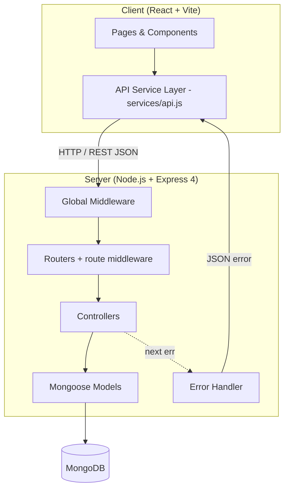
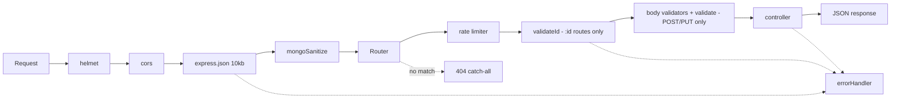

# Design Document: StartupMeu DealFlow

## Overview

StartupMeu DealFlow is a mini startup-investor marketplace. Visitors can browse, search and filter startup profiles, open a detail page, create / edit / delete profiles, and view a dashboard of aggregate statistics. It is a full-stack JavaScript application: a React (Vite) frontend talking to a Node.js / Express REST API backed by MongoDB. All data lives in MongoDB. No mock or in-memory data is used anywhere in the application code.

There is no authentication (out of scope for this assessment). Anyone can create, edit or delete a profile. This is documented as a known limitation in the README.

### Technology Decisions

| Area | Choice | Notes |
|---|---|---|
| Runtime | Node.js >= 18 | |
| Server framework | Express **4** | Pinned (`express@4`). `express-mongo-sanitize` is not compatible with Express 5. |
| Module system (server) | **CommonJS** | `require` / `module.exports`. Do NOT add `"type": "module"` to `server/package.json`. |
| Database / ODM | MongoDB + Mongoose | |
| Server validation | `express-validator` v7 | |
| Security | `helmet`, `cors`, `express-rate-limit` (v7+), `express-mongo-sanitize` | |
| Config | `dotenv` | Loaded on the first line of `server.js`. |
| Dev tooling | `nodemon` | |
| Frontend | React + Vite (JavaScript) | |
| Routing | `react-router-dom` | |
| Styling | Tailwind CSS **v4** via the `@tailwindcss/vite` plugin | No `tailwind.config.js`; `index.css` contains `@import "tailwindcss";`. |

---

## Part 1 — High-Level Design

### 1.1 System Architecture



### 1.2 Directory Structure

```
project-root/
├── client/
│   ├── public/
│   ├── src/
│   │   ├── components/
│   │   │   ├── StartupCard.jsx
│   │   │   ├── StartupForm.jsx
│   │   │   ├── FilterBar.jsx
│   │   │   ├── Pagination.jsx
│   │   │   ├── StatCard.jsx
│   │   │   ├── LoadingSpinner.jsx
│   │   │   ├── EmptyState.jsx
│   │   │   └── ErrorMessage.jsx
│   │   ├── pages/
│   │   │   ├── HomePage.jsx
│   │   │   ├── StartupDetailPage.jsx
│   │   │   ├── CreateStartupPage.jsx
│   │   │   ├── EditStartupPage.jsx
│   │   │   ├── DashboardPage.jsx
│   │   │   └── NotFoundPage.jsx
│   │   ├── services/
│   │   │   └── api.js              # the ONLY place fetch() is called
│   │   ├── utils/
│   │   │   ├── constants.js        # INDUSTRIES, FUNDING_STAGES (mirrors server)
│   │   │   └── format.js           # formatUSD()
│   │   ├── App.jsx
│   │   ├── main.jsx
│   │   └── index.css
│   ├── .env                        # not committed
│   ├── .env.example
│   ├── index.html
│   ├── package.json
│   └── vite.config.js
│
├── server/
│   ├── src/
│   │   ├── config/
│   │   │   └── db.js
│   │   ├── models/
│   │   │   └── Startup.js
│   │   ├── controllers/
│   │   │   ├── startupController.js
│   │   │   └── dashboardController.js
│   │   ├── routes/
│   │   │   ├── startupRoutes.js
│   │   │   └── dashboardRoutes.js
│   │   ├── middleware/
│   │   │   ├── validate.js         # express-validator results -> 422
│   │   │   ├── validateId.js       # bad ObjectId -> 400
│   │   │   ├── rateLimiter.js      # readLimiter + writeLimiter
│   │   │   └── errorHandler.js
│   │   ├── seeds/
│   │   │   └── seed.js             # optional, manual, refuses to run in production
│   │   └── app.js                  # builds the Express app (no listen)
│   ├── server.js                   # entry point: env check, DB connect, listen
│   ├── .env                        # not committed
│   ├── .env.example
│   └── package.json
│
├── .gitignore
└── README.md
```

### 1.3 Frontend Components

| Page | Route | Responsibility |
|---|---|---|
| `HomePage` | `/` | Startup list with search, filters, pagination |
| `StartupDetailPage` | `/startups/:id` | Full profile, Edit and Delete actions |
| `CreateStartupPage` | `/startups/new` | Create form |
| `EditStartupPage` | `/startups/:id/edit` | Edit form pre-filled from the API |
| `DashboardPage` | `/dashboard` | Aggregate stats |
| `NotFoundPage` | `*` | "Page not found" with a link home |

| Component | Props | Purpose |
|---|---|---|
| `StartupCard` | `startup` | Compact card with link to detail page |
| `StartupForm` | `initialData`, `onSubmit`, `isLoading`, `serverErrors`, `submitLabel` | Shared create/edit form with inline errors |
| `FilterBar` | `searchInput`, `industry`, `stage`, `onSearchChange`, `onIndustryChange`, `onStageChange` | Search box + two dropdowns |
| `Pagination` | `page`, `totalPages`, `onPageChange` | Hidden when `totalPages <= 1` |
| `StatCard` | `label`, `value` | Single metric tile |
| `LoadingSpinner` | — | Centered spinner |
| `EmptyState` | `message`, `action` (optional) | Empty results, optional button (e.g. "Clear filters") |
| `ErrorMessage` | `message` | Error box |

### 1.4 Data Model

**Startup**

| Field | Type | Constraints |
|---|---|---|
| `name` | String | required, trimmed, 1–100 chars |
| `tagline` | String | required, trimmed, 1–150 chars |
| `description` | String | required, trimmed, 10–2000 chars |
| `industry` | String (enum) | required |
| `fundingStage` | String (enum) | required |
| `fundingRequired` | Number | required, 0 to 1,000,000,000,000 (USD) |
| `location` | String | required, trimmed, 1–100 chars |
| `website` | String | optional, trimmed, max 200 chars, `http(s)://` URL, default `''` |
| `createdAt`, `updatedAt` | Date | automatic (`timestamps: true`) |

- **Industries:** `Technology`, `Healthcare`, `Finance`, `Education`, `E-commerce`, `SaaS`, `Consumer`, `Deep Tech`, `Climate Tech`, `Other`
- **Funding stages:** `Pre-seed`, `Seed`, `Series A`, `Series B+`
- **Indexes:** compound `{ industry: 1, fundingStage: 1 }`. No text index (name search uses an escaped, case-insensitive regex so partial words work).

### 1.5 REST API

Base URL: `http://localhost:5000/api`

| Method | Path | Description |
|---|---|---|
| GET | `/startups` | List with `search`, `industry`, `stage`, `page`, `limit` |
| GET | `/startups/:id` | Single startup |
| POST | `/startups` | Create |
| PUT | `/startups/:id` | Full update (all 8 editable fields required) |
| DELETE | `/startups/:id` | Delete |
| GET | `/dashboard/stats` | Aggregate statistics |

**Query parameters for `GET /startups`**

| Param | Default | Rules |
|---|---|---|
| `search` | — | string only, trimmed, max 100 chars, case-insensitive partial match on `name` |
| `industry` | — | string only, exact match |
| `stage` | — | string only, exact match on `fundingStage` |
| `page` | 1 | integer >= 1 |
| `limit` | 10 | integer, clamped to 1–50 |

**Response shapes**

| Case | Status | Body |
|---|---|---|
| List | 200 | `{ "data": [startup], "pagination": { "page", "limit", "total", "totalPages" } }` |
| Single / created / updated | 200 / 201 | `{ "data": startup }` |
| Deleted | 200 | `{ "message": "Startup deleted successfully" }` |
| Body validation failed | 422 | `{ "errors": [{ "field", "message" }] }` |
| Invalid `:id` format | 400 | `{ "message": "Invalid ID format" }` |
| Malformed JSON body | 400 | `{ "message": "Invalid JSON body" }` |
| Body too large | 413 | `{ "message": "Request body too large" }` |
| Not found (resource or route) | 404 | `{ "message": "Startup not found" }` / `{ "message": "Route not found" }` |
| Rate limit exceeded | 429 | `{ "message": "Too many requests, please try again later" }` |
| Unexpected error | 500 | `{ "message": "Something went wrong" }` (real message only when `NODE_ENV !== 'production'`) |

An empty result set is `200` with `data: []` — never a 404.

**Dashboard response**

```json
{
  "data": {
    "totalStartups": 24,
    "byIndustry": [{ "_id": "Technology", "count": 8 }],
    "byStage": [{ "_id": "Seed", "count": 10 }],
    "totalFundingRequired": 12500000,
    "averageFundingRequired": 520833
  }
}
```

### 1.6 Security Measures

| Concern | Mechanism |
|---|---|
| HTTP headers | `helmet()` |
| Cross-origin | `cors({ origin: CLIENT_URL })` — one explicit origin, no wildcard; the server refuses to start if `CLIENT_URL` is missing |
| Brute force / abuse | `readLimiter` 100 req / 15 min on GET routes, `writeLimiter` 50 req / 15 min on POST/PUT/DELETE, both per IP, JSON 429 |
| Proxy awareness | `trust proxy` is set only when `TRUST_PROXY` is defined (e.g. `1` on Render/Railway). Left unset locally so clients cannot spoof `X-Forwarded-For` to dodge the limiter |
| Body flooding | `express.json({ limit: '10kb' })` |
| NoSQL injection | `express-mongo-sanitize`, plus `typeof === 'string'` guards on query params and `.isString()` on every text field |
| Regex injection / ReDoS | Search input escaped before use in `$regex`, length capped at 100 |
| Mass assignment | `createStartup` and `updateStartup` destructure the 8 allowed fields; raw `req.body` is never passed to Mongoose |
| Tab-napping | External links use `target="_blank" rel="noopener noreferrer"` |
| `javascript:` links | Website must start with `http://` or `https://` on both client and server |
| Secrets | Only in `.env` (git-ignored); `.env.example` has placeholders only |
| Error leakage | Stack traces and Mongoose internals never returned in production |

---

## Part 2 — Low-Level Design

### 2.1 Request Lifecycle



`validateId` and `validate` end the request themselves with 400 / 422 when they fail. Everything else that throws reaches `errorHandler`.

### 2.2 Server Entry Point (`server.js`)

```javascript
require('dotenv').config()   // MUST be the first line, before app.js is required

const REQUIRED_ENV = ['MONGODB_URI', 'CLIENT_URL']
const missing = REQUIRED_ENV.filter((key) => !process.env[key])
if (missing.length > 0) {
  console.error(`Missing required environment variables: ${missing.join(', ')}`)
  process.exit(1)
}

const connectDB = require('./src/config/db')
const app = require('./src/app')

const PORT = process.env.PORT || 5000

async function start() {
  await connectDB()                       // exits the process on failure
  app.listen(PORT, () => console.log(`Server running on port ${PORT}`))
}

start()
```

`config/db.js`: `mongoose.connect(process.env.MONGODB_URI)` inside try/catch; log success; on failure log the error and `process.exit(1)`.

### 2.3 Express App (`src/app.js`)

```javascript
const express = require('express')
const helmet = require('helmet')
const cors = require('cors')
const mongoSanitize = require('express-mongo-sanitize')
const startupRoutes = require('./routes/startupRoutes')
const dashboardRoutes = require('./routes/dashboardRoutes')
const errorHandler = require('./middleware/errorHandler')

const app = express()

// Only trust a proxy when explicitly configured (e.g. TRUST_PROXY=1 on Render/Railway)
if (process.env.TRUST_PROXY) app.set('trust proxy', Number(process.env.TRUST_PROXY))

app.use(helmet())
app.use(cors({ origin: process.env.CLIENT_URL, methods: ['GET', 'POST', 'PUT', 'DELETE'] }))
app.use(express.json({ limit: '10kb' }))
app.use(mongoSanitize())

app.use('/api/startups', startupRoutes)
app.use('/api/dashboard', dashboardRoutes)

app.use((req, res) => res.status(404).json({ message: 'Route not found' }))
app.use(errorHandler)   // must be last

module.exports = app
```

Routers are mounted exactly once, here. `CLIENT_URL` has no trailing slash (e.g. `http://localhost:5173`).

### 2.4 Rate Limiters (`middleware/rateLimiter.js`)

Defined in their own file and imported by the routers. Defining them in `app.js` would make routers import from `app.js` while `app.js` imports the routers (circular import).

```javascript
const rateLimit = require('express-rate-limit')

const handler = (req, res) =>
  res.status(429).json({ message: 'Too many requests, please try again later' })

// `limit` is called `max` in express-rate-limit v6 and earlier
const readLimiter  = rateLimit({ windowMs: 15 * 60 * 1000, limit: 100, standardHeaders: true, legacyHeaders: false, handler })
const writeLimiter = rateLimit({ windowMs: 15 * 60 * 1000, limit: 50,  standardHeaders: true, legacyHeaders: false, handler })

module.exports = { readLimiter, writeLimiter }
```

### 2.5 Model (`models/Startup.js`)

```javascript
const mongoose = require('mongoose')

const INDUSTRIES = ['Technology', 'Healthcare', 'Finance', 'Education', 'E-commerce',
                    'SaaS', 'Consumer', 'Deep Tech', 'Climate Tech', 'Other']
const FUNDING_STAGES = ['Pre-seed', 'Seed', 'Series A', 'Series B+']
const MAX_FUNDING = 1_000_000_000_000

const startupSchema = new mongoose.Schema({
  name:            { type: String, required: true, trim: true, minlength: 1,  maxlength: 100 },
  tagline:         { type: String, required: true, trim: true, minlength: 1,  maxlength: 150 },
  description:     { type: String, required: true, trim: true, minlength: 10, maxlength: 2000 },
  industry:        { type: String, required: true, enum: INDUSTRIES },
  fundingStage:    { type: String, required: true, enum: FUNDING_STAGES },
  fundingRequired: { type: Number, required: true, min: 0, max: MAX_FUNDING },
  location:        { type: String, required: true, trim: true, minlength: 1,  maxlength: 100 },
  website:         { type: String, trim: true, maxlength: 200, default: '' }
}, { timestamps: true })

startupSchema.index({ industry: 1, fundingStage: 1 })

module.exports = mongoose.model('Startup', startupSchema)
module.exports.INDUSTRIES = INDUSTRIES
module.exports.FUNDING_STAGES = FUNDING_STAGES
module.exports.MAX_FUNDING = MAX_FUNDING
```

### 2.6 Route Middleware

**`validateId.js`** — a plain 24-character hex check (Mongoose's `isValid` also accepts any 12-character string, which is too loose):

```javascript
function validateId(req, res, next) {
  if (!/^[0-9a-fA-F]{24}$/.test(req.params.id)) {
    return res.status(400).json({ message: 'Invalid ID format' })
  }
  next()
}
```

**`validate.js`** — collects `express-validator` results:

```javascript
const { validationResult } = require('express-validator')

function validate(req, res, next) {
  const errors = validationResult(req)
  if (!errors.isEmpty()) {
    return res.status(422).json({
      errors: errors.array().map((e) => ({ field: e.path, message: e.msg }))
    })
  }
  next()
}
```

**Validators** (in `startupRoutes.js`, one array reused by POST and PUT):

```javascript
const requiredText = (field, label, { min = 1, max }) =>
  body(field)
    .isString().withMessage(`${label} must be text`).bail()
    .trim().notEmpty().withMessage(`${label} is required`).bail()
    .isLength({ min, max }).withMessage(`${label} must be ${min}–${max} characters`)

const startupValidators = [
  requiredText('name', 'Name', { max: 100 }),
  requiredText('tagline', 'Tagline', { max: 150 }),
  requiredText('description', 'Description', { min: 10, max: 2000 }),
  requiredText('location', 'Location', { max: 100 }),

  body('industry').notEmpty().withMessage('Industry is required').bail()
    .isIn(INDUSTRIES).withMessage('Invalid industry'),

  body('fundingStage').notEmpty().withMessage('Funding stage is required').bail()
    .isIn(FUNDING_STAGES).withMessage('Invalid funding stage'),

  body('fundingRequired').notEmpty().withMessage('Funding required is required').bail()
    .isFloat({ min: 0, max: MAX_FUNDING }).withMessage('Funding required must be a number between 0 and 1,000,000,000,000')
    .toFloat(),

  body('website').optional({ values: 'falsy' })
    .isString().withMessage('Website must be text').bail()
    .trim().isLength({ max: 200 }).withMessage('Website cannot exceed 200 characters').bail()
    .isURL({ protocols: ['http', 'https'], require_protocol: true })
    .withMessage('Website must be a valid URL starting with http:// or https://')
]
```

**Routes**

```javascript
router.get('/',       readLimiter, getStartups)
router.get('/:id',    readLimiter, validateId, getStartupById)
router.post('/',      writeLimiter, startupValidators, validate, createStartup)
router.put('/:id',    writeLimiter, validateId, startupValidators, validate, updateStartup)
router.delete('/:id', writeLimiter, validateId, deleteStartup)
```

`dashboardRoutes.js`: `router.get('/stats', readLimiter, getDashboardStats)`.

### 2.7 Error Handler (`middleware/errorHandler.js`)

```javascript
function errorHandler(err, req, res, next) {
  console.error(err.stack || err)

  if (err.type === 'entity.parse.failed')  return res.status(400).json({ message: 'Invalid JSON body' })
  if (err.type === 'entity.too.large')     return res.status(413).json({ message: 'Request body too large' })

  if (err.name === 'CastError' && err.kind === 'ObjectId')
    return res.status(400).json({ message: 'Invalid ID format' })

  // Mongoose schema validation -> same shape as the validate middleware
  if (err.name === 'ValidationError' && err.errors) {
    return res.status(422).json({
      errors: Object.values(err.errors).map((e) => ({ field: e.path, message: e.message }))
    })
  }

  const status = err.statusCode || err.status || 500
  const message = process.env.NODE_ENV === 'production' && status === 500
    ? 'Something went wrong'
    : err.message
  res.status(status).json({ message })
}
```

### 2.8 Startup Controller

Express 4 does not catch errors thrown in async handlers, so every function wraps its body in `try/catch` and calls `next(err)`.

```javascript
const escapeRegex = (s) => s.replace(/[.*+?^${}()|[\]\\]/g, '\\$&')

async function getStartups(req, res, next) {
  try {
    const page  = Math.max(parseInt(req.query.page, 10) || 1, 1)
    const limit = Math.min(Math.max(parseInt(req.query.limit, 10) || 10, 1), 50)

    const str = (v) => (typeof v === 'string' ? v.trim() : '')
    const search   = str(req.query.search).slice(0, 100)
    const industry = str(req.query.industry)
    const stage    = str(req.query.stage)

    const filter = {}
    if (search)   filter.name = { $regex: escapeRegex(search), $options: 'i' }
    if (industry) filter.industry = industry
    if (stage)    filter.fundingStage = stage

    const total = await Startup.countDocuments(filter)
    const startups = await Startup.find(filter)
      .sort({ createdAt: -1 })
      .skip((page - 1) * limit)
      .limit(limit)

    res.json({
      data: startups,
      pagination: { page, limit, total, totalPages: Math.ceil(total / limit) }
    })
  } catch (err) { next(err) }
}

async function getStartupById(req, res, next) {
  try {
    const startup = await Startup.findById(req.params.id)
    if (!startup) return res.status(404).json({ message: 'Startup not found' })
    res.json({ data: startup })
  } catch (err) { next(err) }
}

async function createStartup(req, res, next) {
  try {
    const { name, tagline, description, industry, fundingStage, fundingRequired, location, website } = req.body
    const startup = await Startup.create({
      name, tagline, description, industry, fundingStage, fundingRequired, location, website: website || ''
    })
    res.status(201).json({ data: startup })
  } catch (err) { next(err) }
}

// PUT = full replacement: the client must send all 8 editable fields
async function updateStartup(req, res, next) {
  try {
    const { name, tagline, description, industry, fundingStage, fundingRequired, location, website } = req.body
    const updated = await Startup.findByIdAndUpdate(
      req.params.id,
      { $set: { name, tagline, description, industry, fundingStage, fundingRequired, location, website: website || '' } },
      { new: true, runValidators: true }
    )
    if (!updated) return res.status(404).json({ message: 'Startup not found' })
    res.json({ data: updated })
  } catch (err) { next(err) }
}

async function deleteStartup(req, res, next) {
  try {
    const deleted = await Startup.findByIdAndDelete(req.params.id)
    if (!deleted) return res.status(404).json({ message: 'Startup not found' })
    res.json({ message: 'Startup deleted successfully' })
  } catch (err) { next(err) }
}
```

### 2.9 Dashboard Controller

The four queries run in parallel with `Promise.all`:

```javascript
async function getDashboardStats(req, res, next) {
  try {
    const [totalStartups, byIndustry, byStage, funding] = await Promise.all([
      Startup.countDocuments(),
      Startup.aggregate([{ $group: { _id: '$industry', count: { $sum: 1 } } }, { $sort: { count: -1 } }]),
      Startup.aggregate([{ $group: { _id: '$fundingStage', count: { $sum: 1 } } }, { $sort: { count: -1 } }]),
      Startup.aggregate([{ $group: { _id: null,
        totalFundingRequired: { $sum: '$fundingRequired' },
        averageFundingRequired: { $avg: '$fundingRequired' } } }])
    ])

    res.json({ data: {
      totalStartups, byIndustry, byStage,
      totalFundingRequired: funding[0]?.totalFundingRequired ?? 0,
      averageFundingRequired: Math.round(funding[0]?.averageFundingRequired ?? 0)
    } })
  } catch (err) { next(err) }
}
```

### 2.10 Seed Script (`seeds/seed.js`) — optional

The seed script is a manual development helper that writes real documents to MongoDB (it is not mock data and is never imported by the app).

```javascript
if (process.env.NODE_ENV === 'production') {   // first check, before anything else
  console.error('Seed script cannot run in production.')
  process.exit(1)
}
require('dotenv').config()
// connectDB() -> Startup.deleteMany({}) -> Startup.insertMany([...10-15 docs...]) -> mongoose.disconnect()
```

The sample documents cover all 10 industries and all 4 funding stages. `npm run seed` runs it from `server/`. It deletes existing startups, so only run it against a development database.

### 2.11 Environment Variables

`server/.env.example`
```
PORT=5000
MONGODB_URI=mongodb://localhost:27017/startupmeu
NODE_ENV=development
CLIENT_URL=http://localhost:5173
# Set to 1 only when deployed behind a reverse proxy (Render, Railway, nginx)
TRUST_PROXY=
```

`client/.env.example`
```
VITE_API_URL=http://localhost:5000/api
```

`MONGODB_URI` and `CLIENT_URL` are required; the server exits with a clear message if either is missing. Real `.env` files are git-ignored.

### 2.12 Frontend API Service (`services/api.js`)

```javascript
const BASE_URL = import.meta.env.VITE_API_URL || 'http://localhost:5000/api'

function buildQueryString(params = {}) {
  const clean = Object.fromEntries(
    Object.entries(params).filter(([, v]) => v !== undefined && v !== null && v !== '')
  )
  return new URLSearchParams(clean).toString()
}

async function request(path, options = {}) {
  let res
  try {
    res = await fetch(`${BASE_URL}${path}`, { headers: { 'Content-Type': 'application/json' }, ...options })
  } catch (err) {
    if (err.name === 'AbortError') throw err          // intentional cancellation: let callers detect it
    throw { status: 0, message: 'Network error — please check your connection' }
  }

  // ANY non-JSON response is an error, even a 200 (wrong URL, proxy page, etc.)
  const contentType = res.headers.get('content-type') || ''
  if (!contentType.includes('application/json')) {
    throw { status: res.status, message: 'Unexpected server response' }
  }

  const data = await res.json()
  if (!res.ok) throw { status: res.status, ...data }
  return data
}

export const getStartups     = (params, signal) => request(`/startups?${buildQueryString(params)}`, { signal })
export const getStartupById  = (id, signal)     => request(`/startups/${id}`, { signal })
export const createStartup   = (body)           => request('/startups', { method: 'POST', body: JSON.stringify(body) })
export const updateStartup   = (id, body)       => request(`/startups/${id}`, { method: 'PUT', body: JSON.stringify(body) })
export const deleteStartup   = (id)             => request(`/startups/${id}`, { method: 'DELETE' })
export const getDashboardStats = (signal)       => request('/dashboard/stats', { signal })
```

Thrown values are plain objects `{ status, message }` or `{ status, errors: [{ field, message }] }`.

### 2.13 Client-Side Form Validation

`validateForm(values)` returns an object keyed by field name (empty object means valid) and mirrors the server rules: name 1–100, tagline 1–150, description 10–2000, location 1–100, industry and stage required (must be one of the known options), `fundingRequired` a number between 0 and 1,000,000,000,000, and website optional but, when present, parsed with `new URL()` and required to have protocol `http:` or `https:`.

On submit: if `validateForm` returns errors, show them and do not call the API. Otherwise convert `fundingRequired` to a `Number`, trim strings, and call the API. If the API throws `{ errors }`, map each `{ field, message }` onto the matching field. Any other error is shown in a banner above the form.

### 2.14 HomePage State, Debounce and Cancellation

A single `query` object holds everything that triggers a fetch, so a filter change and its page reset happen in one update (one request, no double fetch):

```javascript
const [searchInput, setSearchInput] = useState('')          // what the user is typing
const [query, setQuery] = useState({ search: '', industry: '', stage: '', page: 1 })
const [startups, setStartups] = useState([])
const [pagination, setPagination] = useState(null)
const [isLoading, setIsLoading] = useState(true)
const [error, setError] = useState(null)

// 1. Debounce typing -> query.search (400 ms). No state change if the value is unchanged.
useEffect(() => {
  const timer = setTimeout(() => {
    const value = searchInput.trim()
    setQuery((prev) => (prev.search === value ? prev : { ...prev, search: value, page: 1 }))
  }, 400)
  return () => clearTimeout(timer)
}, [searchInput])

// 2. Fetch whenever query changes; abort the previous request on cleanup.
useEffect(() => {
  const controller = new AbortController()
  setIsLoading(true)
  setError(null)

  getStartups(query, controller.signal)
    .then((res) => { setStartups(res.data); setPagination(res.pagination); setIsLoading(false) })
    .catch((err) => {
      if (err.name === 'AbortError') return               // cancelled on purpose: touch no state
      setError(err.message || 'Failed to load startups')
      setIsLoading(false)
    })

  return () => controller.abort()
}, [query])
```

- Industry / stage dropdowns: `setQuery((p) => ({ ...p, industry: value, page: 1 }))`.
- Pagination: `setQuery((p) => ({ ...p, page }))`.
- "Clear filters" (shown in the empty state only when a filter or search is active): `setSearchInput('')` and `setQuery({ search: '', industry: '', stage: '', page: 1 })`.
- Rendering order: loading → `LoadingSpinner`; error → `ErrorMessage`; empty list → `EmptyState`; otherwise `FilterBar` + grid of `StartupCard` + `Pagination`. The `FilterBar` stays mounted in every state so typing is never interrupted.
- `.finally()` is deliberately not used, because it would run `setIsLoading(false)` for an aborted request while its replacement is still loading.

### 2.15 Other Page Behaviour

- **Detail page:** fetch with `getStartupById(id, signal)`. Status 404 or 400 shows "Startup not found". Delete uses `window.confirm`, disables the button while deleting, navigates to `/` on success, and shows an error banner on failure. Funding is shown with `Intl.NumberFormat('en-US', { style: 'currency', currency: 'USD', maximumFractionDigits: 0 })`. The website link uses `target="_blank" rel="noopener noreferrer"` and is only rendered when a website exists.
- **Edit page:** fetches the startup first (loading / not-found / error states), then renders `StartupForm` with it as `initialData`. On success it navigates to `/startups/:id`.
- **Create page:** on success it navigates to `/startups/:newId` using `res.data._id`.
- **Dashboard page:** fetches stats on mount. If `totalStartups === 0` it shows an `EmptyState` with a link to create a startup. Otherwise it shows four `StatCard`s (total startups, top industry = `byIndustry[0]._id`, total funding, average funding) plus two labelled breakdown lists.
- **Routing:** `BrowserRouter` with the five routes above and a `*` route to `NotFoundPage`. A top navigation bar links to Home, New Startup and Dashboard.